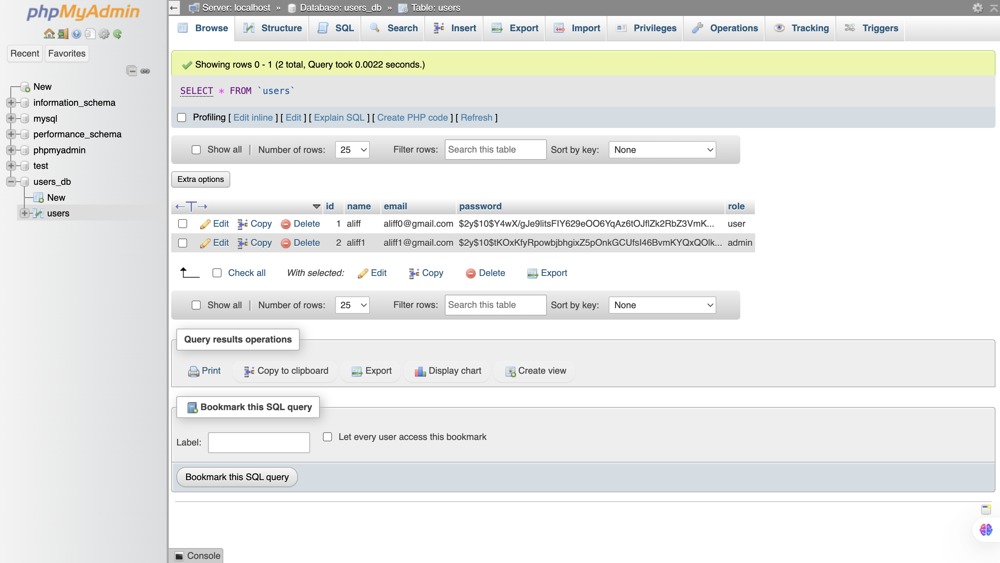

# Login and registration 
User or admin login and registration page using PHP and MySQL

<table>
  <tr>
    <td>
      
    </td>
    <td>
      
    </td>
  </tr>
  <tr>
    <td>Login</td>
    <td>Register</td>
  </tr>
  <tr>
    <td>
      
    </td>
    <td>
      
    </td>
  </tr>
  <tr>
    <td>User Page</td>
    <td>Admin Page</td>
  </tr>
  <tr>
    <td>
      
    </td>
  </tr>
  <tr>
    <td>MySQL table</td>
  </tr>
</table>

